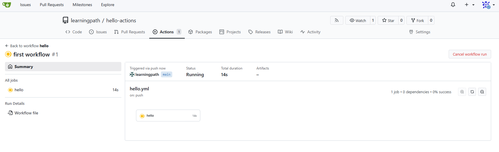

# 01 — First workflow

**Goal:** a push triggers a job that runs in a fresh container.

**Run:** copy `hello.yml` to `.github/workflows/hello.yml` in your practice repo, push.

**Expect:** Actions tab → `hello #1` green; log shows the commit, the container OS and the
cloned files. First run ~2 min (image pull), then seconds.

**Break it**
- delete the `actions/checkout` step → `ls -la` shows an empty workspace
- `runs-on: ubuntu-24.04` → job waits forever (no runner has that label)
